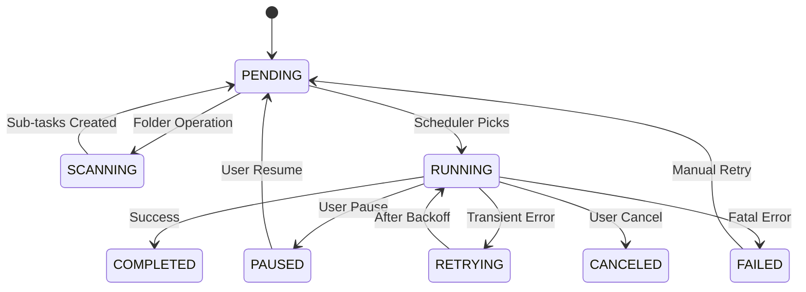

# 任务创建和调度的设计文档

## 1. 背景与目标
StoreLink 作为一个多存储客户端工具，需要处理海量文件操作。为了保证 UI 响应、支持复杂任务（同步/迁移）以及在异常退出后可恢复，需要一套严谨的任务调度系统。

### 核心目标
- **可靠性 (Reliability)**：任务状态持久化，支持软件崩溃或重启后的恢复与续传。
- **高性能 (Performance)**：利用 Worker 线程池，支持流式传输，减少内存占用。
- **可控性 (Controllability)**：精细的并发控制、优先级管理、任务暂停/取消及进度实时反馈。
- **可扩展性 (Extensibility)**：标准化的接口，易于增加新的存储协议和任务类型。

---

## 2. 核心架构设计

### 2.1 任务分层模型
1.  **管理层 (TaskManager)**：
    - 职责：任务生命周期维护、数据库持久化、与 UI 的 IPC 通信。
    - 优化：引入 **Progress Throttler**，防止高频进度更新导致渲染进程卡死。
2.  **调度层 (TaskScheduler)**：
    - 职责：维护任务队列，根据并发策略分发任务到 Worker。
    - 优化：由“轮询”改为“**事件驱动 + 令牌桶**”机制。当有新任务或 Worker 空闲时触发调度。
3.  **执行层 (Task Worker)**：
    - 职责：独立线程执行 IO，封装存储适配器。
    - 优化：支持 **AbortSignal** 远程取消，支持流式管道直连。

### 2.2 任务实体 (TaskEntity) 升级
- `id`: UUID 唯一标识。
- `parentId`: 支持 **Task Group** 概念，用于目录递归操作。
- `priority`: 0-100，UI 手动触发任务默认更高。
- `executionPolicy`: 并发限制策略（如：全速、限速、单线程）。
- `checkpoint`: 断点信息，记录已传输的字节数或文件索引。

---

## 3. 关键机制与优化

### 3.1 任务分级拆分 (Folder Operations)
对于大文件夹操作，采用三级结构：
1.  **Group (父任务)**：代表用户的一次点击（如“下载文件夹 A”）。不直接执行，仅汇总子任务进度。
2.  **Task (子任务)**：代表单个文件的具体操作。
3.  **Sub-steps (原子步骤)**：针对超大文件的分片上传/下载步骤。

**流程：**
- `TaskManager` 收到文件夹任务 -> 插入一条 Group 记录。
- 启动一个轻量级递归任务（Scanner）扫描文件树 -> 批量插入子 Task 记录。
- `TaskScheduler` 捡起子 Task 进行并发执行。

### 3.2 跨存储流式管道 (Streaming Pipe)
避免磁盘中转，核心逻辑：
```typescript
// Worker 内部逻辑
const source = await sourceAdapter.getReadStream(sourceKey);
const target = await targetAdapter.putWriteStream(targetKey, size);

// 使用 pipeline 处理流并支持 AbortSignal
await pipeline(source, target, { signal: abortController.signal });
```
- **内存保护**：设置 `highWaterMark` 限制缓冲区大小。
- **校验和同步**：在 Pipeline 中插入 `Transform` 流计算 MD5。

### 3.3 并发控制策略
不再仅限制全局并发（如 Piscina 默认 5），引入 **Per-Connection Limit**：
- 每个 ConnectionID 拥有独立的信号量（Semaphore）。
- 防止一个缓慢的存储（如 SFTP）占满所有线程，导致其他存储任务饥饿。

### 3.4 进度反馈优化 (Progress Throttling)
- **Worker 侧**：每 500ms 或进度变化 >1% 时通过 `MessageChannel` 发送消息。
- **Main 侧**：使用 `requestAnimationFrame` 风格的定时器，每 100ms 批量聚合所有任务进度并单次 IPC 发送给渲染进程。

---

## 4. 异常处理与恢复

### 4.1 错误分类
- **可重试错误 (Retryable)**：网络超时、429 频率限制。
- **致命错误 (Fatal)**：权限不足、存储空间已满、认证失效。
- **处理方式**：可重试错误采用 **指数退避 (Exponential Backoff)** 策略；致命错误立即标记为 `FAILED` 并通知用户。

### 4.2 软件重启恢复
- 应用启动时，`TaskManager` 扫描数据库。
- `PENDING` 任务重新加入调度队列。
- `RUNNING` 任务（因闪退导致）根据任务幂等性（Idempotency）决定：
    - **幂等任务**（如上传）：重置为 `PENDING` 重新开始或从断点续传。
    - **非幂等任务**（如移动）：标记为 `FAILED` 需人工确认。

---

## 5. 状态转换图 (Mermaid)


---

## 6. 后续迭代
1.  **带宽限制器 (Bandwidth Limiter)**：在流式管道中加入频率控制。
2.  **差异化比对 (Diff Engine)**：支持基于 CRC64/MD5 的极速同步。
3.  **任务优先级抢占**：高优先级任务可暂停低优先级任务的 Worker 以获取资源。
