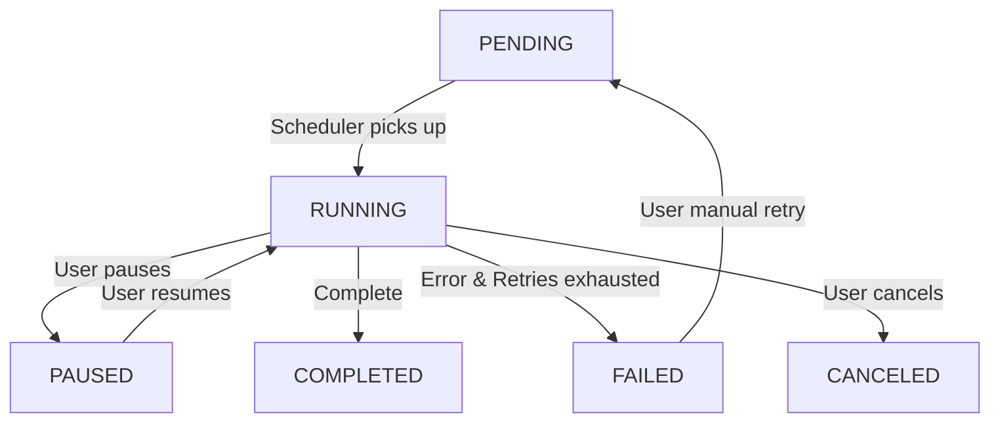

# 任务创建和调度的设计文档

## 1. 背景与目标
StoreLink 作为一个多存储客户端工具，需要处理大量的文件操作任务。为了提升用户体验（如进度展示、任务挂起/恢复）以及支持复杂的跨存储操作（如同步、迁移），需要构建一个健壮的任务层。

### 核心目标
- **标准化任务生命周期**：统一任务的创建、执行、持久化、进度更新和异常处理。
- **高性能跨存储传输**：支持不同存储连接之间的数据流式传输，避免不必要的磁盘中转。
- **任务调度与并发控制**：合理管理并发任务数，支持任务优先级和自动轮询。
- **可恢复性**：支持软件重启后的任务状态恢复和断点续传（取决于协议支持）。

---

## 2. 核心架构设计

### 2.1 任务分层模型
任务层分为三层：
1.  **管理层 (TaskManager)**：负责任务的 CRUD、状态持久化（SQLite）、与渲染进程的 IPC 通信。
2.  **调度层 (TaskScheduler)**：负责任务的队列管理、并发控制（Piscina Worker 池）、以及任务的启停逻辑。
3.  **执行层 (Task Worker)**：在独立线程中执行具体操作，封装适配器调用和跨存储流式传输逻辑。

### 2.2 任务实体 (TaskEntity)
每个任务由 `TaskEntity` 表示，包含：
- `taskId`: 唯一标识。
- `type`: 任务类型 (UPLOAD, DOWNLOAD, COPY, MOVE, SYNC, DELETE)。
- `source`: 源信息（connectionId, path, metadata）。
- `target`: 目标信息（connectionId, path）。
- `status`: 当前状态 (PENDING, RUNNING, PAUSED, COMPLETED, FAILED, CANCELED)。
- `progress`: 进度信息（totalSize, processedSize, speed）。
- `retryConfig`: 重试策略。

---

## 3. 关键功能实现方案

### 3.1 基础任务 (Download/Upload)
- **下载 (DOWNLOAD)**:
    - 源：远程存储适配器。
    - 目标：本地文件系统。
    - 实现：调用适配器的流式读取接口，通过 `fs.createWriteStream` 写入本地。
- **上传 (UPLOAD)**:
    - 源：本地文件系统。
    - 目标：远程存储适配器。
    - 实现：使用 `fs.createReadStream` 读取文件，调用适配器的流式写入接口。

### 3.2 跨存储传输 (Transfer/Sync)
这是本设计的重点。
- **流式管道 (Streaming Pipe)**:
    - Worker 同时初始化 `sourceStore` 和 `targetStore`。
    - 获取源存储的 `ReadableStream`。
    - 将其直接 Pipe 到目标存储的写入方法（需扩展适配器以支持接收 Stream 写入）。
    - *示例代码逻辑：*
      ```typescript
      const reader = await sourceStore.getStream(sourcePath);
      await targetStore.putStream(targetPath, reader, { size, onProgress });
      ```
- **同步任务 (SYNC)**:
    - 属于复合任务，首先进行目录树比对（Diff）。
    - 根据比对结果生成一系列子任务（UPLOAD, DOWNLOAD, DELETE）。

### 3.3 目录级任务拆分
对于包含多个文件或子目录的任务：
- **方案 A (简单)**: 一个任务对应一个目录，Worker 内部递归处理。优点：管理简单。缺点：进度不精细，无法部分重试。
- **方案 B (推荐)**: 任务拆分为“父子结构”。
    - 父任务 (Task Group)：代表整个目录操作，维护总体进度。
    - 子任务 (Sub-task)：代表单个文件的操作。
    - 存储：在数据库中通过 `parentId` 关联。

---

## 4. 接口与契约扩展

### 4.1 适配器接口扩展 (IStorageHandler)
为了支持高效传输，需明确流式读写接口：
```typescript
export interface IStorageHandler {
  // 获取读取流
  getReadStream(params: { key: string }): Promise<Readable>;
  // 接收读取流并写入
  putWriteStream(params: { key: string, size: number }, stream: Readable, onProgress?: Function): Promise<void>;
}
```

### 4.2 任务消息定义
- **task:create**: 渲染进程发起任务。
- **task:update**: 主进程推送进度和状态。
- **task:command**: 暂停、继续、取消。

---

## 5. 状态转换图


---

## 6. 后续优化方向
1.  **分片上传/下载**：针对大文件支持并发分片。
2.  **带宽限制**：全局或单任务限速。
3.  **校验和验证**：传输完成后进行 MD5/CRC 校验。
4.  **增量同步算法**：基于 mtime 或 etag 的快速同步。
